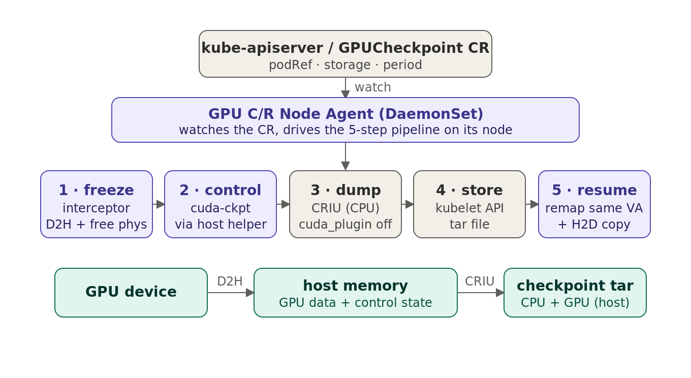

# K8s-Native Fast GPU Checkpoint/Restore System

A Kubernetes-native implementation of the **GCR** (*GPU Checkpoint/Restore Made
Fast and Lightweight*, FAST '26) approach, packaged as a Custom Resource plus a
per-node agent. This repository brings GCR's **control/data-separated hybrid
C/R** into a Kubernetes cluster so that GPU Pods can be checkpointed
transparently, on a schedule, without modifying the workload.

> Status: **Checkpoint path verified end-to-end** on K8s v1.33 + CRI-O + NVIDIA
> A100 (driver 570). The `GPUCheckpoint` CR + `GPU C/R Node Agent` perform the
> full GCR pipeline: the interceptor **owns GPU memory via the CUDA VMM API**
> (framework-agnostic — no `expandable_segments`), copies data to host and frees
> physical memory while preserving virtual addresses; `cuda-checkpoint` handles
> control state; **CRIU dumps CPU + host-resident data only** (the CRIU
> `cuda_plugin` is disabled — CRIU never touches the GPU); then the source is
> resumed and remapped. There is **no separate controller** — each Node Agent
> watches the CR directly. **Follow [`docs/SETUP.ko.md`](docs/SETUP.ko.md) (KO) /
> [`docs/SETUP.md`](docs/SETUP.md) (EN) to run it from a fresh VM.** Restore into
> a NEW container (tar → container) needs CRI-O support and is next
> (see [Roadmap](#roadmap)).

> 🇰🇷 한국어 문서: [`README.ko.md`](README.ko.md)

This work is based on:

- Paper: *GPU Checkpoint/Restore Made Fast and Lightweight* (Zeng et al., Tsinghua University, FAST '26)
- Upstream artifact: <https://github.com/thustorage/GCR>
- DCN Lab Progress Report (2026-06-16), "Design Checkpoint/Restore System in Kubernetes"

---

## Why

System-level GPU C/R enables elastic serverless scaling, fast task switching, and
fault-tolerant training. GCR achieves low C/R latency **and** near-zero
normal-execution overhead by:

- **Control/data separation** — only the GPU *memory* APIs
  (`cuMemCreate/Map/Unmap/Release`) are intercepted via `LD_PRELOAD` (< 1%
  overhead), while control state uses the efficient driver-integrated path
  (`cuda-checkpoint`).
- **Virtual/physical memory decoupling** — the GPU page table (virtual
  addresses) is preserved while physical memory is released and re-mapped on
  restore, removing address-consistency overhead.
- **Shadow execution + dirty templates** — incremental checkpointing that stores
  only modified buffers.

This project wires those mechanisms into Kubernetes primitives.

---

## Architecture



> Purple = our GCR components · gray = reused K8s platform · teal = checkpoint data path. CRIU never touches the GPU: the interceptor (data) + cuda-checkpoint (control) move GPU state to host memory first, then CRIU dumps CPU + host memory. See also [`docs/K8S-CHALLENGES.ko.md`](docs/K8S-CHALLENGES.ko.md) (K8s limitations → solutions) and slides [`docs/slides/GCR-K8s-limitations.pptx`](docs/slides/GCR-K8s-limitations.pptx).

```
                       Kubernetes Cluster
  Control Plane
  ┌───────────────────────────────────────────────────────────┐
  │   GPUCheckpoint CR  (podRef.nodeInfo, storage, period)        │
  └───────────────────────────────────────────────────────────┘
                          ▲
                          │ (1) Watch  — no separate controller
  Worker Node             │
  ┌───────────────────────────────────────────────────────────┐
  │  GPU Pod                              GPU C/R Node Agent      │
  │   ├─ GPU APP                          (DaemonSet, this repo)  │
  │   └─ GPU Selective Interceptor  ◄──(2) signal / checkpoint    │
  │        (libgcr-interceptor.so)                                │
  └───────────────────────────────────────────────────────────┘
                                   │ (3) push Checkpoint.tar
                                   ▼
                          Shared Storage (hostPath / NFS / S3)
```

There is **no GPU C/R Controller**. The Node Agent runs **one replica per node**
(DaemonSet), watches `GPUCheckpoint` CRs directly, and acts only on the ones
whose `podRef.nodeInfo` matches its own node — so all heavy operations are local
and the control plane stays a single declarative CR.

### Checkpoint pipeline (per `GPUCheckpoint`)

1. **Data-buffer freeze (GCR data engine)** — the in-Pod interceptor backs
   `cudaMalloc` with the CUDA **VMM** API (`cuMemCreate/Map`), so it owns the GPU
   memory. On the agent's checkpoint signal it copies each buffer **D2H into
   process (host) memory**, then frees ONLY the physical memory
   (`cuMemUnmap`/`cuMemRelease`) while **keeping the virtual address reservation**.
2. **Control-state checkpoint** — a **host helper** runs
   `cuda-checkpoint --toggle --pid <gpu-pid>` (in-container execution stack-smashes
   on glibc mismatch; the helper runs it natively and targets the real GPU PID).
3. **Container checkpoint** — the agent calls the **kubelet checkpoint API**, which
   drives **CRIU (CPU only — `cuda_plugin` disabled)** to snapshot the process
   including the host-resident GPU data. Needs **driver 570+** (so cuda-checkpoint
   releases the `/dev/nvidia*` fds and CRIU can dump).
4. **Store** — the archive is written to `.spec.storage`.
5. **Resume (non-destructive)** — cuda-checkpoint resume, then the interceptor
   **recreates physical memory and maps it to the same virtual address + H2D**, so
   the source keeps running.

---

## The `GPUCheckpoint` Custom Resource

```yaml
apiVersion: gpu-cr.io/v1alpha1
kind: GPUCheckpoint
metadata:
  name: ckpt-vllm-001
  namespace: default
spec:
  podRef:                       # which Pod (and where) to checkpoint
    nodeInfo: gpu-node-1        # node the Pod runs on; the agent on this node acts on the CR
    namespace: default
    name: vllm-gcr-pod
    container: vllm             # optional; defaults to the first container
  storage:                      # which filesystem / path to store the artifact
    type: hostPath              # hostPath | nfs | s3
    path: /var/lib/gcr-checkpoint
  period: "000500"             # HHMMSS interval; "000000"/omit = one-shot
  incremental: true            # dirty-only after the first checkpoint
```

| Field | Meaning |
|-------|---------|
| `podRef` | Target Pod: `nodeInfo` (node the Pod runs on), `namespace`, `name`, `container`. The agent only acts when `nodeInfo` matches the node it runs on; if `nodeInfo` is empty it falls back to resolving the node from the Pod. |
| `storage` | Backend type and path where `Checkpoint.tar` is written. |
| `period` | Fixed-width `HHMMSS` checkpoint interval. `"000030"`=30 s, `"000500"`=5 min, `"010000"`=hourly. `"000000"` or empty = one-shot. |
| `incremental` | Enable GCR shadow-execution incremental checkpointing after the first checkpoint. |

CRD: [`config/crd/gpu-cr.io_gpucheckpoints.yaml`](config/crd/gpu-cr.io_gpucheckpoints.yaml)

---

## The GPU C/R Node Agent

A DaemonSet (`cmd/node-agent`) that:

- **Installs the interceptor library on startup** — creates the host library
  directory (`/var/lib/gpu-cr/lib`) and copies in `libgcr-interceptor.so` (and,
  when provided, the GCR hook `libcuda.so`) so any GPU Pod on the node can
  `LD_PRELOAD` it.
- **Watches `GPUCheckpoint` CRs**, filters to its own node, and honours
  `.spec.period` scheduling via the controller-runtime requeue mechanism.
- **Executes the 5-step checkpoint pipeline** above and updates
  `.status` (`phase`, `checkpointCount`, `lastCheckpointTime`,
  `lastCheckpointPath`, conditions).

Key source files:

| File | Responsibility |
|------|----------------|
| `cmd/node-agent/main.go` | Manager bootstrap, library install, flags/env |
| `internal/agent/reconciler.go` | Node-filtered reconcile + period scheduling |
| `internal/agent/checkpoint.go` | 5-step checkpoint pipeline + crictl PID resolution |
| `internal/agent/interceptor.go` | Library install + GCR signal channel |
| `internal/agent/kubelet.go` | Kubelet checkpoint API client |
| `internal/agent/period.go` | `HHMMSS` period parsing |

---

## Selective CUDA interception (`LD_PRELOAD`)

`interceptor/preload.c` is the shim a GPU Pod loads. It hooks `dlopen` so that
when the CUDA runtime loads `libcuda.so.1`, GCR's hook driver
(`$GCR_HOME/libcuda.so`) is loaded instead — which selectively intercepts only
the GPU memory-management APIs (calls from `libcublas` are passed straight to the
real driver). This mirrors `thustorage/GCR` `GCR/preload.c`.

Pod wiring (see [`deploy/sample-pod.yaml`](deploy/sample-pod.yaml)):

```yaml
env:
  - name: LD_PRELOAD
    value: /opt/gpu-cr/libgcr-interceptor.so
  - name: GCR_HOME
    value: /opt/gpu-cr
volumeMounts:
  - name: gpu-cr-lib
    mountPath: /opt/gpu-cr
    readOnly: true
volumes:
  - name: gpu-cr-lib
    hostPath:
      path: /var/lib/gpu-cr/lib   # installed by the Node Agent
      type: Directory
```

> The **GCR hook driver** (`libcuda.so`) that performs the actual `cuMem*`
> interception is built from upstream `thustorage/GCR` (`GCR/build.sh`) and
> dropped next to the shim. The shim and the agent orchestration are provided
> here; building the upstream hook is a node prerequisite.

---

## Repository layout

```
.
├── api/v1alpha1/                  # GPUCheckpoint types + deepcopy + scheme
├── cmd/node-agent/                # agent entrypoint
├── internal/agent/                # reconciler, pipeline, kubelet, interceptor, period
├── interceptor/                   # LD_PRELOAD shim (preload.c) + Makefile
├── config/crd/                    # CustomResourceDefinition
├── deploy/                        # rbac, daemonset, sample Pod, sample CR
├── Dockerfile                     # builds agent + shim image (Buildah/Containerfile compatible)
└── README.md / README.ko.md
```

---

## Prerequisites & Server Setup

> 📖 **Step-by-step install guide (Master + Worker, copy-paste commands):**
> [`docs/SETUP.md`](docs/SETUP.md) · 한국어 [`docs/SETUP.ko.md`](docs/SETUP.ko.md)

To actually run and test this system you need to prepare the GPU nodes, the
container runtime, and the Kubernetes cluster up front. The list below is the
full set; for a pure control-flow smoke test you can skip the GPU/CRIU pieces and
run the agent with `--dry-run=true`.

### 1. Hardware

| Item | Requirement |
|------|-------------|
| GPU | NVIDIA GPU supported by driver ≥ 550 (paper/Progress Report used A100-40GB). |
| Host RAM | The checkpoint backend is **CPU memory**, so size RAM ≥ the GPU memory you intend to snapshot (e.g. ≥ 40 GB for an A100-40GB workload), plus headroom. |
| Disk | Free space on the storage path for `Checkpoint.tar` (tens of GB per checkpoint for LLMs). |

### 2. GPU node OS packages

```bash
# NVIDIA driver >= 550 (provides control-state C/R). On Ubuntu 22.04 + a 6.8
# kernel, install gcc-12 FIRST so the DKMS kernel module builds (see docs/SETUP.md C-1).
nvidia-smi                       # driver >= 550.x ; GPU visible
# cuda-checkpoint is NOT on PATH from apt — install the prebuilt binary:
#   github.com/NVIDIA/cuda-checkpoint  (see docs/SETUP.md C-1b)
cuda-checkpoint --help

# CRIU >= 3.17 — kubelet/CRI container checkpoint uses it for CPU-side state
sudo apt-get install -y criu     # or build from source
criu --version
sudo criu check                  # should report "Looks good."

# NVIDIA Container Toolkit — exposes GPUs to containers
#   https://docs.nvidia.com/datacenter/cloud-native/container-toolkit/
nvidia-ctk --version
```

> The **GCR hook driver** (`libcuda.so`) that performs the actual selective
> `cuMem*` interception is **not** part of this repo. Build it from upstream
> [`thustorage/GCR`](https://github.com/thustorage/GCR) (`GCR/build.sh`) and place
> the resulting `libcuda.so` into `/var/lib/gpu-cr/lib/` on each GPU node, next to
> the `libgcr-interceptor.so` the agent installs. Without it, the shim falls back
> to the real driver (no GPU-side C/R).

### 3. Container runtime with checkpoint support

Use **containerd ≥ 1.7** or **CRI-O ≥ 1.25** built with CRIU support.

```bash
# containerd: confirm the CRI socket the agent will use
ls -l /run/containerd/containerd.sock
# CRI-O alternative: /run/crio/crio.sock  (update the DaemonSet hostPath accordingly)
```

### 4. Kubernetes cluster configuration

```text
# Kubernetes v1.30+ recommended.
# Enable the ContainerCheckpoint feature gate on BOTH the kubelet and the
# kube-apiserver (beta in 1.30; enable explicitly on older versions):
#   --feature-gates=ContainerCheckpoint=true
```

- **NVIDIA device plugin** (and ideally GPU Feature Discovery) so Pods can request
  `nvidia.com/gpu` and nodes carry the `nvidia.com/gpu.present=true` label the
  DaemonSet selects on:
  ```bash
  kubectl get nodes -L nvidia.com/gpu.present
  kubectl describe node <gpu-node> | grep nvidia.com/gpu
  ```
- **PodSecurity**: the agent runs `privileged`, `hostPID`, `hostNetwork`. Label
  the namespace to allow it:
  ```bash
  kubectl label ns gpu-cr-system pod-security.kubernetes.io/enforce=privileged
  ```
- **kubelet checkpoint API access**: the agent's ServiceAccount is granted
  `nodes/checkpoint` + `nodes/proxy` via `deploy/rbac.yaml`. Confirm the kubelet
  serves on `:10250` and that authn/authz (webhook) is enabled (default on
  kubeadm clusters).

### 5. Build & registry tooling (on your build host)

```bash
go version          # 1.22+
gcc --version ; make --version
buildah --version   # used instead of Docker to build the image
# A reachable image registry you can push to (e.g. ghcr.io) and pull from on nodes.
buildah login ghcr.io
```

### 6. Pre-flight verification (run on a GPU node)

```bash
nvidia-smi -L                                   # GPU visible
cuda-checkpoint --help                          # driver C/R available
sudo criu check                                 # CRIU healthy
ls /run/containerd/containerd.sock              # CRI socket present
kubectl version --short                         # server >= v1.30
kubectl get --raw /api/v1/nodes/$(hostname)/proxy/checkpoint/ 2>&1 | head  # endpoint reachable (403/expects POST = OK)
ls /var/lib/gpu-cr/lib/libcuda.so               # GCR hook driver staged (after step 2)
```

If any GPU/CRIU item is missing, you can still validate the orchestration with
`--dry-run=true` (no privileged host ops are performed).

### Single-node vs multi-node

- **Single-node test**: `storage.type: hostPath` is enough (checkpoint stays on
  the node).
- **Multi-node / migration test**: use shared storage (`type: nfs`, mount the
  same path on every node) so a checkpoint taken on one node is reachable from the
  restore node.

---

## Quick start

**To run from a fresh GPU VM, follow [`docs/SETUP.ko.md`](docs/SETUP.ko.md) (KO) /
[`docs/SETUP.md`](docs/SETUP.md) (EN)** — they use the scripts in `quickstart/scripts/`
(GPU worker prep incl. driver 570 + CRIU + cuda_plugin disable + host helper, and
master deploy) and the verified run config. The condensed flow:

```bash
# worker (each, root): driver 570 + toolkit + CRIU + helper + plugin-off (one reboot)
sudo bash quickstart/scripts/gpu-worker-setup.sh   # reboot, then re-run
# master: device plugin + label + CRD/RBAC/DaemonSet, then set agent mode
bash quickstart/scripts/master-deploy.sh
kubectl -n gpu-cr-system set env ds/gpu-cr-node-agent GCR_INTERCEPTION=true CUDA_CHECKPOINT_SKIP=false
# build the agent+interceptor image and roll out
buildah bud -f Dockerfile -t docker.io/<you>/gpu-cr-node-agent:v1.0 . && buildah push docker.io/<you>/gpu-cr-node-agent:v1.0 docker://docker.io/<you>/gpu-cr-node-agent:v1.0
kubectl -n gpu-cr-system rollout restart ds/gpu-cr-node-agent
# run + checkpoint
kubectl apply -f deploy/sample-pod-l1.yaml
kubectl apply -f deploy/sample-gpucheckpoint-l1.yaml
kubectl get gpucheckpoints.gpu-cr.io -w            # Completed
```

<details><summary>Legacy manual build steps (dev)</summary>

Use `--dry-run=true` to exercise the control flow on a cluster without GPUs.

```bash
# 1. Build the interceptor shim
make -C interceptor

# 2. Resolve Go deps and build the agent
go mod tidy
go build ./...

# 3. Build & push the agent image with Buildah
buildah bud -f Dockerfile -t ghcr.io/gprojectdev/gpu-cr-node-agent:latest .
buildah push ghcr.io/gprojectdev/gpu-cr-node-agent:latest \
  docker://ghcr.io/gprojectdev/gpu-cr-node-agent:latest
# (login first if needed: buildah login ghcr.io)

# 4. Install into the cluster
kubectl apply -f config/crd/gpu-cr.io_gpucheckpoints.yaml
kubectl apply -f deploy/rbac.yaml
kubectl apply -f deploy/daemonset.yaml

# 5. Run a GPU Pod and request checkpoints
kubectl apply -f deploy/sample-pod.yaml
kubectl apply -f deploy/sample-gpucheckpoint.yaml

# 6. Observe
kubectl get gpucheckpoints
# NAME            POD            NODE        PERIOD   PHASE       COUNT   LAST
# ckpt-vllm-001   vllm-gcr-pod   gpu-node-1  000500   Completed   3       30s
```

</details>

---

## Development

```bash
go test ./...            # unit tests (period parsing, etc.)
go vet ./...
make -C interceptor      # build libgcr-interceptor.so
```

The agent's `--dry-run=true` mode skips privileged host operations
(`cuda-checkpoint`, kubelet API, crictl) while still exercising reconciliation,
status updates, and the storage layout — useful for local/kind clusters.

---

## Roadmap

Tracks the three questions in the DCN Progress Report:

1. **Integrate GCR into K8s** — `GPUCheckpoint` CR + Node Agent (no separate
   controller). ✅ **Done & verified**: VMM-owned data engine (copy + physical-free +
   address-preserving remap), cuda-checkpoint control, CRIU CPU-only, non-destructive
   resume.
2. **Restore into a NEW container (tar → container)** — needs CRI-O support to
   reuse the checkpoint image; ordering **Control State → GPU Data Buffer**. *(next,
   user-triggered)*
3. **Incremental checkpointing** — shadow execution + dirty templates so only
   modified buffers are stored (shrinks tar size). *(future)*

---

## Acknowledgements

GCR design and upstream code by Shaoxun Zeng, Tingxu Ren, Jiwu Shu, and Youyou Lu
(Tsinghua University), FAST '26. This repository is an independent Kubernetes
integration developed at the Distributed Cloud and Network Research Laboratory
(DCN Lab).
